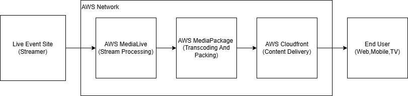

# AWS MediaLive RTMP Input Terraform Configuration

## Overview
This Terraform configuration sets up an **AWS Elemental MediaLive RTMP input**, including:
- **IAM Role** for MediaLive access.
- **Security Group** to control RTMP traffic.
- **MediaLive Input** for RTMP streaming.
- **Output variables** to retrieve important details.

## Prerequisites
Ensure you have the following:
- **Terraform** installed ([Install Guide](https://developer.hashicorp.com/terraform/tutorials/aws-get-started/install-cli))
- **AWS CLI** configured with proper credentials (`aws configure`)
- **An AWS account** with permission to create MediaLive resources

## Usage

### 1. Initialize Terraform
Run the following command to initialize the working directory:
```sh
terraform init
```

### 2. Plan the Deployment
Preview the changes that Terraform will apply:
```sh
terraform plan
```

### 3. Apply the Configuration
Deploy the infrastructure to AWS:
```sh
terraform apply -auto-approve
```

### 4. Retrieve Output Values
After deployment, get the RTMP input details:
```sh
terraform output
```

### 5. Destroy the Infrastructure
To remove all resources:
```sh
terraform destroy -auto-approve
```

## Outputs
- **`medialive_input_id`**: The ID of the MediaLive input.
- **`medialive_input_arn`**: The ARN of the MediaLive input.
- **`medialive_input_destinations`**: The RTMP endpoint URLs.

## Adding Letterbox Bars to a 4:3 Video Using FFmpeg
If your input video has a **4:3** aspect ratio and you need to convert it to **16:9** by adding letterbox bars, use the following FFmpeg command:

```sh
ffmpeg -i input.mp4 -vf "pad=width:height:(ow-iw)/2:(oh-ih)/2" output.mp4
```

Replace `width` and `height` with the target **16:9** resolution. For example, if your input video is **640x480 (4:3)** and you want to fit it into **854x480 (16:9)**:

```sh
ffmpeg -i input.mp4 -vf "pad=854:480:(ow-iw)/2:(oh-ih)/2" output.mp4
```

### Breakdown of FFmpeg Command

#### **Command Structure:**
```sh
ffmpeg -i input.mp4 -vf "pad=width:height:(ow-iw)/2:(oh-ih)/2" output.mp4
```

#### **Explanation of Flags:**

- **`ffmpeg`** → The command-line tool used for processing multimedia files.
- **`-i input.mp4`** → Specifies the input file (`input.mp4`).
- **`-vf "pad=width:height:(ow-iw)/2:(oh-ih)/2"`** → Applies the video filter for letterboxing:
  - **`pad=width:height:x:y`** → Defines padding to maintain aspect ratio.
  - **`width`** → Target width of the output video (e.g., 854 for 16:9 format).
  - **`height`** → Target height of the output video (e.g., 480 for 16:9 format).
  - **`x = (ow-iw)/2`** → Centers the original video horizontally.
  - **`y = (oh-ih)/2`** → Centers the original video vertically (adds black bars to top and bottom).
- **`output.mp4`** → The name of the final output file with letterboxing applied.

## Notes
- Modify `region` in `main.tf` to match your AWS region (e.g., `ca-central-1` for Canada).
- Restrict security group and input security rules for enhanced security.
- Check AWS MediaLive pricing before deploying ([AWS Pricing](https://aws.amazon.com/medialive/pricing/)).

## Author
This Terraform configuration was created to automate the setup of an AWS MediaLive RTMP input for live streaming.

## Architectural Diagram
This shows the flow from the live event source all the way to the end user.



1. Live Event Site (Camera & Encoder) → Captures and encodes the video feed.
2. AWS MediaLive (Stream Processing) → Handles the RTMP/SRT stream from the encoder.
3. AWS MediaPackage (Transcoding & Packaging) → Converts video into HLS/DASH for adaptive streaming.
4. Amazon CloudFront (Content Delivery Network - CDN) → Distributes the stream globally with low latency.
5. End User Devices (Web, Mobile, TV) → Viewers watch the live stream.